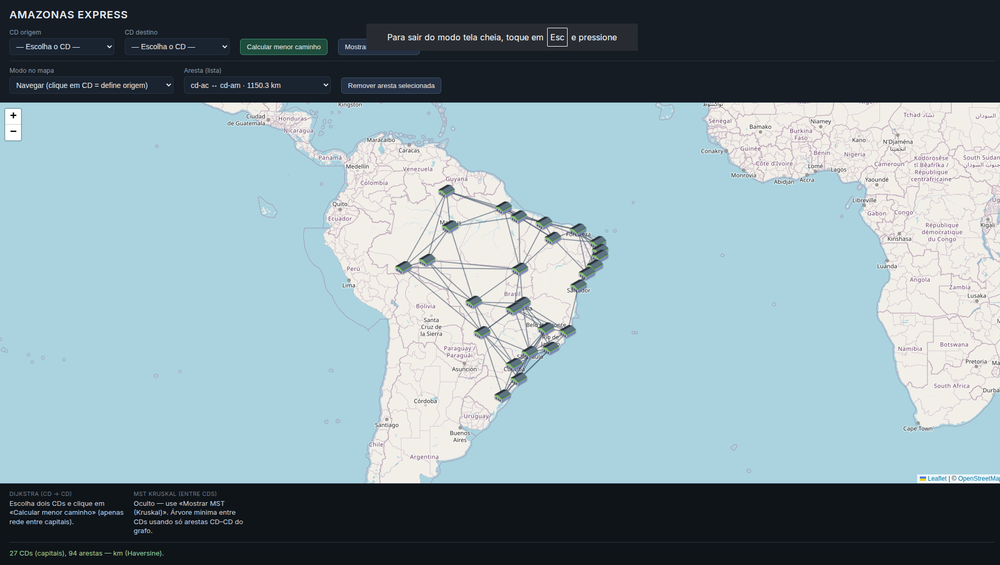
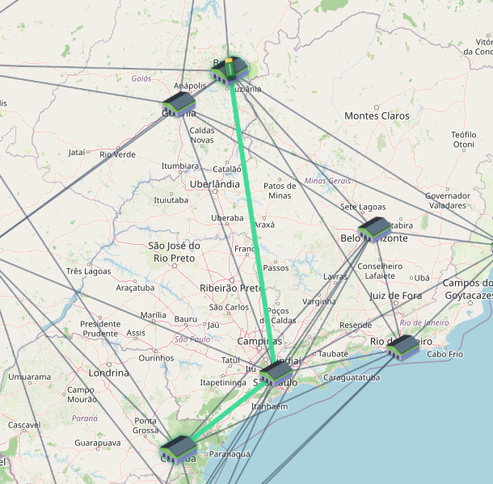
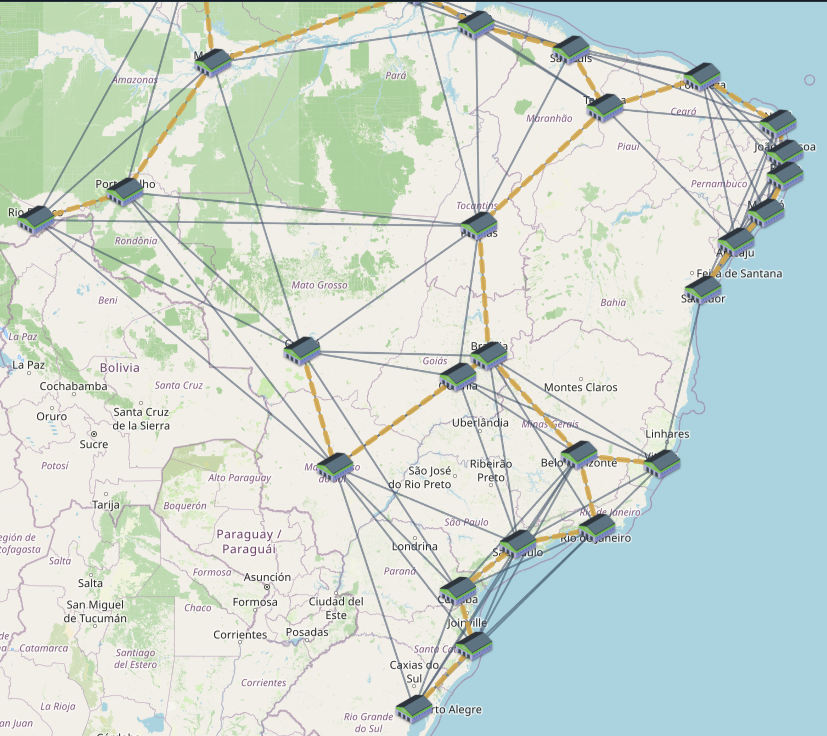

# AMAZON EXPRESS (DIJKSTRA & KRUSKAL)

Número da Lista: 16<br>
Conteúdo da Disciplina: Grafos (dijkstra & kruskal)<br>

## Alunos

| Matrícula   | Aluno                 |
| ----------- | --------------------- |
| 24/2015773  | Caio Breno de Souza Bezerra  |
| 24/2015138  | Bruno Ferreira Dornelas |

## Sobre

O **Amazon Express** é uma aplicação web que modela uma **malha logística entre centros de distribuição (CDs)** das capitais brasileiras como um **grafo não direcionado ponderado**: cada CD é um vértice e cada conexão logística é uma aresta cujo peso é a **distância em quilômetros** calculada pela fórmula de **Haversine** a partir das coordenadas geográficas.

O projeto tem dois focos pedagógicos e práticos:

1. **Menor caminho (Dijkstra)** — Dados um CD de origem e um de destino, o algoritmo de Dijkstra encontra o caminho de menor custo total (soma dos km) usando apenas arestas ativas. O resultado é desenhado no mapa, com **animação de um caminhão** percorrendo a rota, e métricas exibidas no rodapé.
2. **Árvore geradora mínima entre CDs (Kruskal)** — Sobre o subgrafo induzido pelos vértices do tipo CD, aplica-se **Kruskal** com **Union-Find** (compressão de caminho e união por rank) para obter uma **MST** que minimiza o total de km na “espinha dorsal” da rede. O botão alterna a visualização dessa MST no mapa.

O mapa interativo usa **Leaflet** e tiles do **OpenStreetMap**. É possível **editar o grafo** no próprio mapa: modo navegação (clique em CD define origem), **ligar dois CDs** com dois cliques, **remover aresta** clicando na linha ou pela lista, o que altera os resultados de Dijkstra e Kruskal em tempo real.

Os dados iniciais vêm de `data/seed.js` (CDs + arestas geradas por vizinhos mais próximos e alguns trechos extras). A estrutura do grafo está em `js/graph.js`; os algoritmos em `js/algorithms.js`; a interface e o desenho no mapa em `js/app.js`.

## Screenshots

| Visão geral do mapa | Menor caminho (Dijkstra) |
| :---: | :---: |
|  |  |

| MST (Kruskal) |
| :---: |
|  |

## Instalação

**Linguagem:** JavaScript (ES modules), HTML5, CSS3<br>
**Framework:** não há framework de interface (aplicação estática). **Bibliotecas:** [Leaflet 1.9.4](https://leafletjs.com/) (via CDN) para o mapa; tiles carregados da rede (OpenStreetMap).

**Pré-requisitos**

- Navegador atualizado com suporte a **módulos ES** (`import`/`export`).
- Conexão com a **internet** (Leaflet, folhas de estilo e tiles do mapa).
- **Node.js** (opcional, mas recomendado): apenas se quiser servir os arquivos por HTTP com o script do projeto — evita limitações de alguns navegadores ao abrir `index.html` direto do sistema de arquivos.

**Comandos**

```bash
cd projeto_grafos
npm start
```

O `package.json` não declara dependências locais; o script `start` usa `npx serve` para subir um servidor estático na pasta atual.

O servidor estático sobe na porta **3000** (conforme `package.json`). Abra no navegador: `http://localhost:3000`.

**Alternativa sem Node:** abra o arquivo `index.html` diretamente; se o navegador bloquear módulos locais, use `npm start` ou outro servidor estático (`python -m http.server`, etc.) na pasta raiz do repositório.

## Uso

1. **Menor caminho:** escolha **CD origem** e **CD destino** nos selects (ou, no modo *Navegar*, clique em um marcador de CD para definir origem). Clique em **Calcular menor caminho**. A rota aparece em destaque no mapa e o rodapé mostra distância e resumo; o caminhão anima ao longo do caminho.
2. **MST:** clique em **Mostrar MST (Kruskal)** para exibir ou ocultar as arestas da árvore geradora mínima entre os CDs; confira o total de km no rodapé.
3. **Editar grafo:** em **Modo no mapa**, use *Ligar dois nós* (dois cliques em CDs) para criar aresta, ou *Remover aresta* (clique na linha ou selecione na lista e remova). Arestas desativadas não entram no Dijkstra nem no Kruskal entre CDs.

## Outros

- **Vídeo da apresentação:** [YouTube — apresentação do projeto](https://www.youtube.com/watch?v=iAldR33za0E)
- Estrutura útil do repositório: `index.html`, `css/styles.css`, `js/app.js`, `js/graph.js`, `js/algorithms.js`, `js/geo.js`, `data/seed.js`, `assets/` (ícones, capturas de tela).

